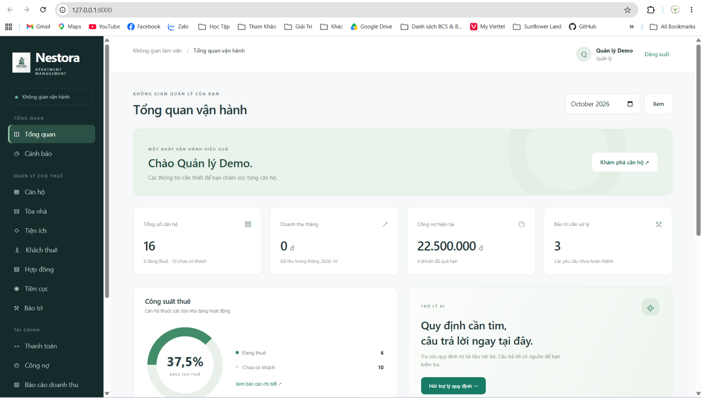

# Nestora — Hệ thống quản lý thuê căn hộ có tích hợp AI

Ứng dụng web Django cho Nhóm 02, lớp CNTT K23K, Khoa Công nghệ thông tin, Trường Đại học Công nghệ thông tin và Truyền thông. Nguyễn Phương Anh (Trưởng nhóm), Lừu Thị Huệ (Phó nhóm). Yêu cầu được đối chiếu với docs/requirements/ContextProject.txt, docs/requirements/project.md và docs/requirements/informember.md. Giao diện tiếng Việt phục vụ Quản lý, Nhân viên và Kế toán.

## Giao diện web

Màn hình tổng quan Nestora dành cho Quản lý, hiển thị số căn hộ, doanh thu, công nợ, bảo trì, công suất thuê và trợ lý AI. Ảnh sử dụng dữ liệu demo.



## Chức năng

- Đăng nhập/đăng xuất; quản lý tài khoản, khóa tài khoản, phân quyền tại backend.
- Quản lý tòa nhà, căn hộ, tiện ích và số lượng tiện ích trong từng căn hộ.
- Quản lý khách thuê, người liên hệ, tìm kiếm, lọc, sắp xếp và phân trang.
- Hợp đồng: tạo, xem, cập nhật, gia hạn, thanh lý; kiểm tra trùng thời gian thuê; không xóa hợp đồng.
- Tiền cọc nằm trong `Contract.deposit_amount`; quyền cập nhật tiền cọc độc lập với quyền sửa hợp đồng.
- Tiền thuê, phí dịch vụ, công nợ, cảnh báo quá hạn; báo cáo doanh thu theo ngày thu thực tế.
- Tiếp nhận bảo trì, mức độ ưu tiên, trạng thái và ghi chú xử lý.
- Dashboard theo vai trò, công suất thuê và cảnh báo hợp đồng sắp hết hạn.
- Quản lý quy định và tệp TXT/MD/DOCX/PDF có văn bản; trích xuất nội dung, tải xuống có xác thực.
- AI tóm tắt 5 mục, soạn bản nháp thông báo và chatbot tìm tài liệu nội bộ, kèm nguồn.
- Dữ liệu demo hư cấu, lệnh sao lưu SQLite, bộ kiểm thử nghiệp vụ và bảo mật.

## Công nghệ và cấu trúc

Python 3.11–3.13, Django 5.2, Django Templates, HTML/CSS/JavaScript, Bootstrap 5.3.8, SQLite. Có cấu hình PostgreSQL tùy chọn. AI mặc định dùng Google Gemini API và RAG từ tài liệu nội bộ. Adapter OpenAI-compatible và Ollama được giữ làm tùy chọn theo đề bài tổng quát.

```text
backend/         Cấu hình Django, các app nghiệp vụ, migrations và tests
frontend/        templates/, static/, staticfiles/ (giao diện tiếng Việt)
data/            db.sqlite3, media/ và backups/ khi tạo sao lưu
chatbot/          ai_assistant/: views, urls, services và prompts AI
models/          12 model nghiệp vụ, chia theo accounts/buildings/...
RAG/             Tìm kiếm từ khóa, chia đoạn và truy xuất quy định

docs/            Tài liệu thiết kế, sơ đồ và hướng dẫn kiểm thử
docs/requirements/ Ba tài liệu yêu cầu đầu vào và thông tin nhóm
requirements/    base.txt (thư viện chạy), dev.txt (công cụ phát triển)
tools/           Script cài đặt, kiểm tra và chuẩn bị tài nguyên
manage.py        Điểm khởi chạy Django, giữ nguyên lệnh sử dụng
project_paths.py Thiết lập đường dẫn import backend và chatbot
wsgi.py, asgi.py  Điểm khởi chạy khi triển khai
```

Các tệp `backend/<app>/models.py` chỉ xuất lại lớp từ `models/` để Django
nhận diện đúng ứng dụng và giữ nguyên tên bảng, quan hệ, lịch sử migrations.
`models/` chứa model cơ sở dữ liệu; cấu hình model AI vẫn nằm trong `.env`.
Giao diện vẫn dùng Django Templates; không cần chạy một máy chủ frontend riêng.


## Cài đặt nhanh trên Windows

Mở PowerShell trong thư mục dự án. Cần Python có module `venv` và kết nối Internet để tải dependencies.

```powershell
powershell -ExecutionPolicy Bypass -File tools/setup_local.ps1
```

Script tạo `.venv`, cài dependencies, tạo `.env` với secret ngẫu nhiên nếu chưa có, tải Bootstrap về máy, tạo/chạy migrations và tạo dữ liệu demo. Mật khẩu demo ngẫu nhiên được in một lần khi tài khoản mới được tạo. Script không ghi đè `.env`, không đặt lại mật khẩu tài khoản đã tồn tại.

Khởi động:

```powershell
.venv/Scripts/python.exe manage.py runserver 127.0.0.1:8000
```

Mở [ứng dụng tại localhost](http://127.0.0.1:8000). Dừng server bằng Ctrl+C.

### Cài đặt từng bước

```powershell
python -m venv .venv
.venv/Scripts/python.exe -m pip install -r requirements/base.txt
.venv/Scripts/python.exe -X utf8 tools/scaffold_support.py
.venv/Scripts/python.exe -X utf8 tools/vendor_bootstrap.py
.venv/Scripts/python.exe manage.py makemigrations
.venv/Scripts/python.exe manage.py migrate
.venv/Scripts/python.exe -X utf8 manage.py seed_demo
.venv/Scripts/python.exe manage.py runserver
```

Trên Linux/macOS dùng `python3` và `.venv/bin/python` thay cho đường dẫn Windows. `scaffold_support.py` chỉ bổ sung tệp hỗ trợ chưa tồn tại; không ghi đè mã nguồn.

### Tài khoản demo

| Tài khoản | Vai trò | Quyền tiêu biểu |
|---|---|---|
| `quanly` | Quản lý | Quản lý nghiệp vụ, tài khoản, tài liệu, xem mọi báo cáo |
| `nhanvien` | Nhân viên | Căn hộ, khách thuê, hợp đồng, bảo trì, AI tóm tắt |
| `ketoan` | Kế toán | Thanh toán, công nợ, báo cáo tài chính, cập nhật tiền cọc |

Mật khẩu được in bởi `seed_demo`. Có thể chủ động đặt `DEMO_PASSWORD` bằng biến môi trường trước khi tạo tài khoản mới. Quên mật khẩu thì dùng:

```powershell
.venv/Scripts/python.exe manage.py changepassword quanly
```

Tài khoản quản lý ứng dụng không tự có quyền Django Admin. Muốn sử dụng `/admin/`, tạo tài khoản quản trị riêng bằng `manage.py createsuperuser`.

## Cấu hình Google Gemini API

Sửa `.env` cục bộ:

```dotenv
AI_PROVIDER=gemini
AI_BASE_URL=https://generativelanguage.googleapis.com/v1beta
GEMINI_API_KEY=your-google-ai-studio-key
AI_MODEL=your-available-gemini-model-id
AI_TIMEOUT_SECONDS=30
AI_MAX_INPUT_CHARS=24000
```

`AI_BASE_URL` là URL gốc Gemini `/v1beta`, không thêm đường dẫn model. Điền ID model văn bản có hỗ trợ JSON mà tài khoản Google AI Studio được cấp quyền. Không dùng khóa OpenAI cho Gemini. Tham khảo [API chính thức](https://ai.google.dev/api/generate-content) và [danh sách model](https://ai.google.dev/gemini-api/docs/models). Không đưa khóa thật vào README, Git hoặc ảnh chụp. Khởi động lại server sau khi đổi cấu hình.

Không có model/khóa API thì giao diện hiển thị AI chưa cấu hình, không tạo kết quả giả. Các chức năng quản lý vẫn hoạt động. Mỗi tài khoản có giới hạn cơ bản 10 yêu cầu AI/phút; timeout 30 giây; dữ liệu và phản hồi được giới hạn kích thước.

- **Tóm tắt:** mở hợp đồng → AI tóm tắt → xem bản nội dung sẽ gửi → bấm tóm tắt. Các giá trị cá nhân đã biết của khách thuê được che trước khi gửi. Việc che không bảo đảm phát hiện mọi thông tin cá nhân tự do trong văn bản; người dùng có thể kiểm tra bản xem trước.
- **Thông báo:** từ hợp đồng soạn nhắc gia hạn; từ khoản thanh toán soạn nhắc thanh toán. Kết quả là bản nháp có thể sửa/sao chép; ứng dụng không tự gửi email.
- **Chatbot:** hỏi quy định → tìm đoạn liên quan trong quy định đang áp dụng và tệp đính kèm → gọi AI → kiểm tra ID nguồn → hiển thị câu trả lời và trích đoạn nguồn. Không có đoạn phù hợp thì báo thiếu thông tin và không gọi API.

RAG hiện dùng tìm kiếm từ khóa tiếng Việt bỏ dấu, chia đoạn có chồng lấn; không cần vector database. Đây là lựa chọn gọn cho dữ liệu đồ án, chưa tối ưu cho kho tài liệu rất lớn. PDF ảnh quét cần OCR bên ngoài trước khi tải lên.

## Quy tắc nghiệp vụ đã chọn

Chi tiết tại [docs/decisions.md](docs/decisions.md). Các điểm Word chưa chốt được triển khai rõ ràng:

- `contract_content` lưu văn bản phục vụ tóm tắt. Tiền cọc vẫn là trường của hợp đồng, không có bảng Deposit.
- Mỗi Payment là một khoản phải thu toàn bộ. Chưa thanh toán → công nợ bằng toàn bộ số tiền; đã thanh toán → công nợ bằng 0 và phải có ngày thu thực tế. Phiên bản này không nhận thanh toán một phần.
- Hạn hợp đồng được tính bao gồm ngày kết thúc. Hợp đồng đã ký chỉ chiếm căn hộ trong khoảng ngày bắt đầu–kết thúc. Không đặt trùng khoảng thời gian.
- Gia hạn kiểm tra lại lịch. Thanh lý giải phóng căn hộ và giữ nguyên công nợ/tiền cọc để đối soát.
- Cảnh báo sắp hết hạn mặc định 30 ngày, cấu hình bằng `EXPIRY_WARNING_DAYS`.
- Quản lý quản trị tài khoản/tài liệu. Kế toán/Nhân viên chỉ cập nhật tiền cọc khi được cấp `can_edit_deposit` (Quản lý được mặc định).
- Doanh thu không bao gồm tiền cọc. Công suất lấy số căn đang có hợp đồng trong ngày chia số căn thuộc tòa nhà hoạt động, gồm cả căn bảo trì.

## Kiểm thử

```powershell
.venv/Scripts/python.exe manage.py check
.venv/Scripts/python.exe manage.py makemigrations --check --dry-run
.venv/Scripts/python.exe manage.py test tests --verbosity 2
```

Test sử dụng CSDL thử nghiệm, không sửa CSDL demo. Gọi AI trong test được mock để kiểm tra logic và lỗi, không tốn phí API. Kết nối thực với model cần khóa API và một lần thử thủ công riêng. Kịch bản demo tại [docs/manual_test.md](docs/manual_test.md).

## Sao lưu và phục hồi

```powershell
.venv/Scripts/python.exe manage.py backup_database
```

Lệnh tạo bản sao nhất quán bằng SQLite backup API trong `data/backups/`, không ghi đè tệp đã có. Sao lưu thêm `data/media/` để giữ tài liệu đính kèm và giữ bản cấu hình `.env` trong nơi riêng an toàn.

Phục hồi: dừng server, giữ lại CSDL hiện tại để có thể quay lại, sao chép bản sao lưu mong muốn thành `data/db.sqlite3`, phục hồi `data/media/` tương ứng rồi chạy `manage.py check` trước khi mở lại server. Không thay CSDL trong lúc ứng dụng đang ghi dữ liệu. Với PostgreSQL, sử dụng `pg_dump`/`pg_restore`.

## Triển khai

`runserver` phục vụ phát triển. Khi triển khai, đặt `DEBUG=False`, secret ngẫu nhiên, `ALLOWED_HOSTS` đúng hostname, HTTPS qua reverse proxy, rồi chạy `collectstatic`. Dùng Waitress trên Windows:

```powershell
.venv/Scripts/python.exe manage.py collectstatic --noinput
.venv/Scripts/python.exe manage.py check --deploy
.venv/Scripts/waitress-serve.exe --listen=127.0.0.1:8000 wsgi:application
```

Nếu dùng PostgreSQL, cài `psycopg[binary]` và đặt `DB_ENGINE=postgresql` cùng các biến `DB_*`. Dùng CSDL trống và migrate; cấu hình này không tự chuyển dữ liệu SQLite cũ. PostgreSQL được khuyến nghị khi nhiều người cùng sửa dữ liệu vì có khóa hàng cho việc đặt/gia hạn hợp đồng. SQLite có thể báo bận khi nhiều thao tác ghi đồng thời.

Không công khai thư mục `data/media/` qua web server. File được trả về qua view có đăng nhập và `Content-Disposition: attachment`. Giới hạn upload 5 MB tại ứng dụng; cần cấu hình giới hạn tương ứng ở reverse proxy.

Cache mặc định là bộ nhớ tiến trình; khi chạy nhiều worker cần cache dùng chung và rate limit tại reverse proxy cho đăng nhập/AI. Phiên bản đồ án chưa có nhật ký bất biến cho mọi thay đổi tài chính, gửi email tự động hay xử lý thanh toán qua cổng ngân hàng.

## Tài liệu và minh chứng

- [Ánh xạ báo cáo và quyết định triển khai](docs/decisions.md)
- [Sơ đồ dữ liệu và kiến trúc](docs/diagrams/architecture.md)
- [Kịch bản kiểm tra thủ công](docs/manual_test.md)
- [Nhật ký AI của lần xây dựng](docs/ai_evidence/implementation.md)
- [Kế hoạch thử nghiệm prompt](docs/prompts/evaluation.md)

Cơ chế CSRF, template escaping và ORM dựa trên [tài liệu bảo mật Django](https://docs.djangoproject.com/en/5.2/topics/security/).

## Đối chiếu yêu cầu và hồ sơ nộp bài

- [Báo cáo kỹ thuật và use case](docs/technical_report.md)
- [Ma trận đối chiếu ba tài liệu nguồn](docs/requirements_traceability.md)
- [Nhật ký đồng bộ và việc chưa xác nhận](docs/ai_evidence/synchronization.md)
- [Quản lý phiên bản và quy trình kiểm tra](docs/development.md)

Kiểm tra kết nối bằng `.venv/Scripts/python.exe -X utf8 tools/check_ai_connection.py`.
Script chỉ gửi dữ liệu hư cấu và trả mã lỗi khác 0 nếu chưa cấu hình hoặc kết nối thất bại.
Không ghi khóa API vào minh chứng. `AI_API_KEY` cũ chỉ dành cho OpenAI-compatible;
Gemini đọc riêng `GEMINI_API_KEY`. Chọn model có quyền truy cập trước khi thử.
