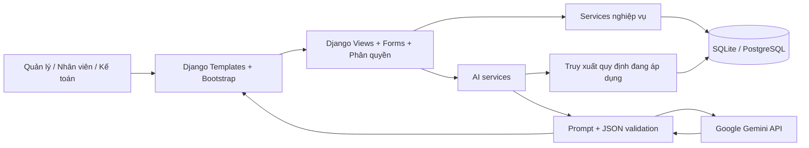
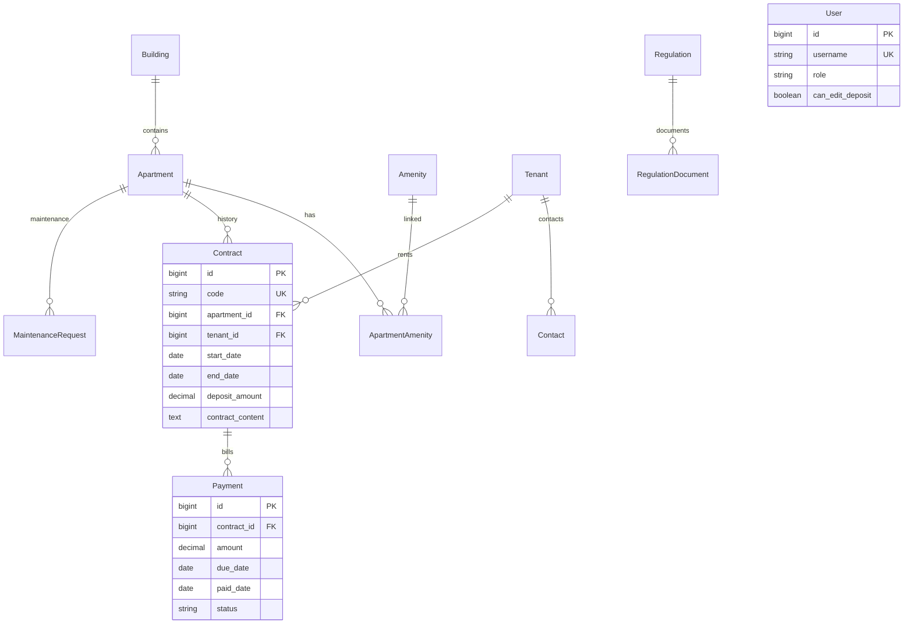

# Kiến trúc và dữ liệu

User không có quan hệ sở hữu bản ghi vì phạm vi đề tài là một đơn vị quản lý và phân quyền theo vai trò. Hệ thống này không phải nền tảng nhiều chủ nhà với dữ liệu cách ly theo tenant.
